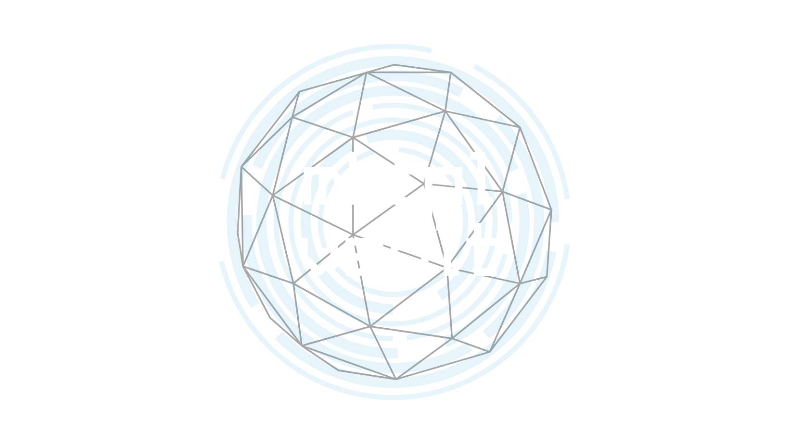

# [LIVE DEMO HERE](https://mktpl-vault.herokuapp.com/)

[](https://www.javascript.com)
[](https://github.com)
[](https://visualstudio.microsoft.com)
[](https://https://npmjs.com/)


# Introduction


## How It Works

The player starts the game by selecting a category, which generates a word within that category. The category button becomes disabled to prevent players from 


The game informs the player of how many letters are in the generated word and displays the blank spaces for each letter. There is a guess counter at the bottom that tells the player how many attempts at guessing a letter is remaining.


If the user guesses the word correctly, they win the game. If they don't guess the word correctly, and they've used all their guesses, they lose.

# Code I Had Trouble With
```
querySelectorAll(`.${guessedLetter}`)
        genWordArr[0].forEach(function(letter) {
            if (letter === guessedLetter) {
                character.forEach(function(guess){
                    guess.style.visibility = "visible"
                })
            }
        })
```
This code took me several hours over the course of days to solve because I had to fix many things to make it work. For example:
1. I had created an array within an array which affected the length and values of some variables I was referencing.
2. I had declared variables within a function and I had trouble figuring out how to reference them. I was eventually able to write the function without referencing them.
There was a lot of researching, trouble shooting, testing, and console logging that took up a large chunk of time.

## Some Immediate Changes I'd Like To Make:
- To add more categories.
- To fix the event-listener to only account for clicks on the letter buttons, not in the entire fieldset.
- To add CSS.
- To be able to start a new game without refreshing the page. Ideally, by selecting a new category at the end of the game.
- To fix the category button so that it does not continuously generate new words without clearing the original array.

## Some Features I Would Like To Add: 
- To change the guess counter to only subtract guesses, if the player guessed incorrectly. It currently counts down regardless of if the guess is correct or not, which will create problems with larger words.
- To add an all or nothing feature that allows the player to type in their guess of the entire word. If they guess the entire word, they win. If they get it wrong, game over.
- To add a timer to prevent unreasonably long game times, but the timer should be able to be toggled on/off by the user.
- To allow for multiple players. I'd like multiple players to be able to take turns guessing the generated word, and to be able to input their own word to have other players guess, rather than just the generated word.
- To be able to keep score for all players.
- To allow players to use their physical keyboard to input words or guesses.