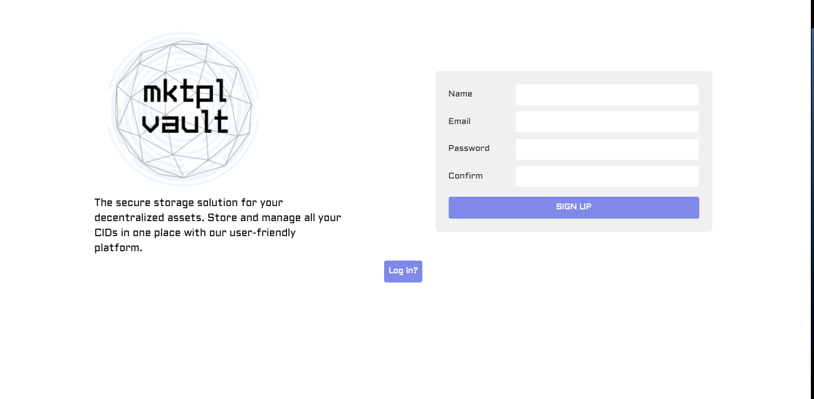
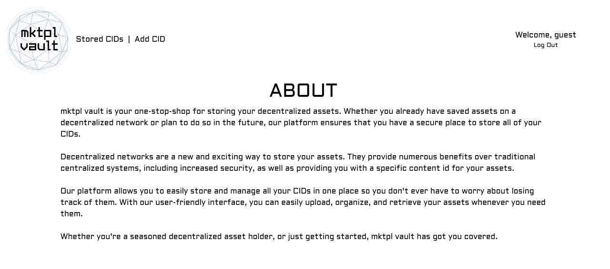
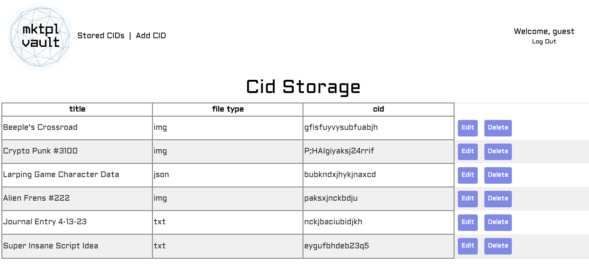
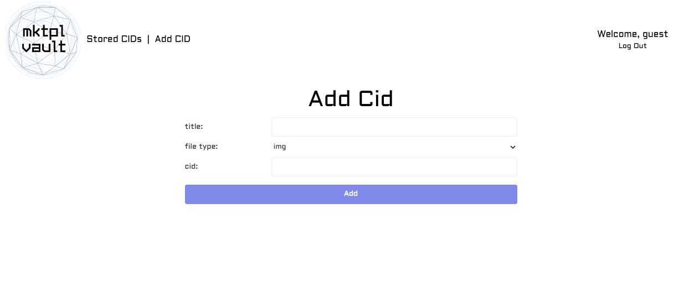

# [LIVE DEMO HERE](https://mktpl-vault.herokuapp.com/)

# Introduction
mktpl-vault is a data storage site that allows you to store all your cids in one place.

## How It Works

The site is secured and only allows access to registered users. This landing page allows visitors to either log in or sign up to the site.

After getting access to the site, the homepage has the apps mission statement, as well as links to your stored database and to add new data, and the option to log out in the top right corner.

The database only shows your added data and gives you the ability to update and delete your data. 

The add cid page allows you to declare a title, filetype, along with your cid. Upon submission, the site redirects you back to your database.

# Technologies Used
- MongoDB
- Express
- React
- Node.js
- Heroku

## Getting Started
- [Trello](https://trello.com/invite/b/88WmbWGW/ATTIc92f271f460a07db62b2b668e3fcfe0f30317340/project-3)
- [ERD](https://lucid.app/lucidchart/10a3e830-b08e-4b32-b93c-a6b339b8420f/edit?viewport_loc=-24%2C-86%2C1045%2C526%2C0_0&invitationId=inv_16aaec1a-50ff-426c-8605-3d9ec1b9929e)
- [WIREFRAME](https://whimsical.com/project-3-XjEJ9uwP75FzJgfjL51t7)

## Next Steps
1. Resolve CSS inconsistencies between my local app and deployed app
2. Implement an api that allows users to pin assets to IPFS directly from mktpl-vault and the generated CID is automatically populated into their database.